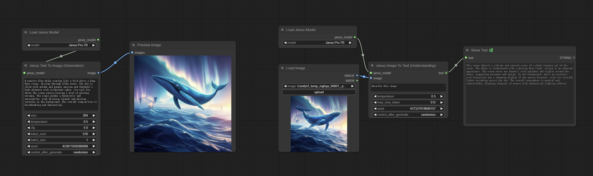
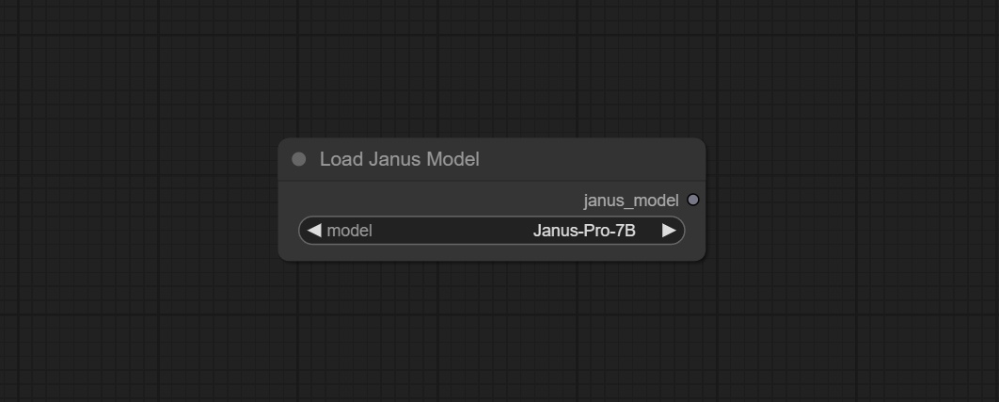
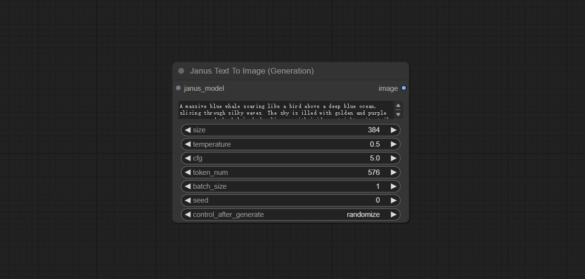
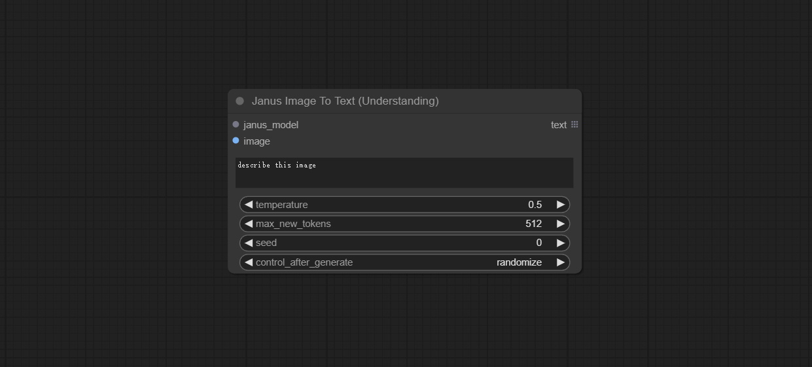

# ComfyUI Janus Wrapper

Unofficial implementation of [deepseek-ai/Janus](https://github.com/deepseek-ai/Janus) in ComfyUI.


  


## Install

* Open a cmd window in the CompyUI plugin directory (e.g. "CompyUI\custom_nodes\") and type    
```
git clone https://github.com/chflame163/ComfyUI_Janus_Wrapper.git
```

* Install dependency packages
Open a cmd window in the plugin directory of ```ComfyUI\custom_nodes\ComfyUI_Janus_Wrapper``` in the resource manager,

&emsp;&emsp;Enter the following command for the ComfyUI Windows Official Portable:

```
..\..\..\python_embeded\python.exe -s -m pip install -r requirements.txt
```
&emsp;&emsp;Enter the following command for the Aki-ComfyUI:

```
..\..\python\python.exe -s -m pip install -r requirements.txt
```

## Download Models
The model will be automatically downloaded during the first run. If the download fails, please manually download the model.
Download all files of the [Janus-Pro-7B](https://huggingface.co/deepseek-ai/Janus-Pro-7B/tree/main ) and copy to  ```ComfyUI\models\Janus-Pro\Janus-Pro-7B``` folder.
Download all files of the [Janus-Pro-1B](https://huggingface.co/deepseek-ai/Janus-Pro-1B/tree/main ) and copy to ```ComfyUI\models\Janus-Pro\Janus-Pro-1B``` folder.

## Nodes Description

### Load Janus Model
Load the Janus model.
  

Node Options:
* model: Select the model. There are currently two models to choose from: Janus-Pro-7B, Janus-Pro-1B

### Janus Text To Image (Generation)
Generate image nodes from text.
  

Node Options:
* janus_model: Janus model input.
* prompt: The prompt text.
* size: The image size, currently only supports 384*384.
* temperature: The temperature parameter of the model.
* cfg: The cfg parameter of the model.。
* token_num: The image_token_num_per_image parameter of the model.
* batch_size: The parallel_size parameter of the model.
* seed: The seed value.
* control_after_gentrate: Change the seed options after generating the image.

### Janus Image To Text (Understanding)
Generate text nodes from images.
  

节点选项：
* janus_model: Janus model input.
* image: The input images.
* question: Questions raised regarding visual recognition of models.
* temperature: The temperature parameter of the model.
* max_new_tokens: The max_new_tokens of the model.
* seed: The seed value.
* control_after_gentrate: Change the seed options after generating the image.


## statement
All nodes follows the MIT license, Some of its functional code comes from other open-source projects. Thanks to the original author. If used for commercial purposes, please refer to the original project license to authorization agreement.
